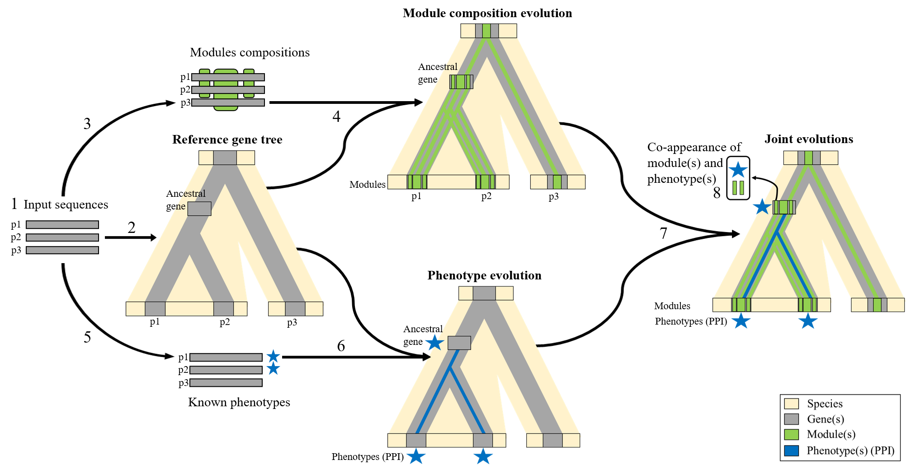

# PhyloCharMod (publication data)
Scripts and data for publication

## Phylogenetic Prediction of Functional Sequence Modules

Introducing an original approach to characterizing functional motifs. This methodology encompasses:
1. Detection of conserved sequence modules (using Partial Local Multiple Alignment)
2. Phylogenetic inference of species/genes/modules/functions evolutionary histories
3. Identification of co-appearances of modules and functions

The process accepts protein sequences and their associated annotations as input. It then returns the presence of conserved sequence modules, along with their associated annotations, across different ancestral genes.



For a more detailed explanation of the methodology, refer to the following article [[Dennler et al. 2023]](https://journals.plos.org/ploscompbiol/article/authors?id=10.1371/journal.pcbi.1011404), or the following PhD thesis (only [available in French](https://www.theses.fr/2022REN1B079)).

## Simple Usage
### Docker Installation
For ease of use, considering the various software and dependencies required, we strongly recommend using our Docker image. 
After installing [Docker](https://www.docker.com/get-started/), you can pull our Docker image using the following command:

```
docker pull ghcr.io/ocmalde/phylocharmod:0.1
```

### Run the Docker Image

```
docker run -w $(pwd) -v $(pwd):$(pwd) --rm ghcr.io/ocmalde/phylocharmod:0.1 python3 /phylocharmod/phylocharmod.py <sequences.fasta> <annotations.csv>
```

#### Input: 
1. ```<sequences.fasta>```:
   
    Each sequence header must adhere to the format: ```>SeqID_taxid```, where ```SeqID``` represents the unique sequence identifier and ```taxid``` is the NCBI species taxid (e.g., ```>NP031426.2_10090```)
   
    Refer to [this file](https://github.com/OcMalde/PhyloCharMod_publ/blob/main/data/min5_human_214_t10m1M20/214.fasta) for an exemple
   
    Please refrain from using special characters in the header (e.g.```, |,()`":;```). Use only ```_``` as a separator.

   These files can be generated using orthogroups and GFF files, all of which are included in the Docker image for the nine species. You only need to compile a file with a list of RefSeq of interest. For detailed instructions, please refer to [To-build-a-sequence-dataset-based-on-orthogroups](https://github.com/OcMalde/PhyloCharMod_publ/tree/main#to-build-a-sequence-dataset-based-on-orthogroups).
   
3. ```<annotations.csv>```:

   This file contains annotations associated with the different sequences

   Each line should be formatted as: ```SeqID,Annotation_1|Annotation_2```. Here, ```SeqID``` is the unique sequence identifier. It's separated from the list of annotations by a comma (```,```), and individual annotations are separated by a pipe (```|```) (e.g., ```NP_620594.1,P00451_F8|P04275_VWF```)

   Refer to [this file](https://github.com/OcMalde/PhyloCharMod_publ/blob/main/data/min5_human_214_t10m1M20/leaf_Manual_214.csv) for an exemple

Output:

## Advanced Usage


## Usage

### To replicate publication results :

```cd data/min5_human_214_t10m1M20/```

```python3 ../../phylocharmod/integrate_3phylo.py seadogMD_214.output gene_tree_214/214.tree --pastml_tab acs_dir_seadogMD_214_gene/pastml_seadogMD_214_gene_leaf_Manual_214_combined_ancestral_states.tab --domains_csv domains_214.csv --itol``` 

### To use on you own data :

```python3 phylocharmod/phylocharmod.py```

(see ```--help``` for details)

```
usage: phylocharmod.py [-h] [--output_directory OUTPUT_DIRECTORY] [--species_tree SPECIES_TREE] [--gene_tree GENE_TREE] [--plma_file PLMA_FILE] [--reconc_domains] multi_fasta_file leaf_functions_csv

positional arguments:
  multi_fasta_file      Multi fasta file, with specific formated header >RefSeq_taxid (ex : >XP_012810820.2_8364)
  leaf_functions_csv    csv file containing for each of our sequence, the list of his functions (ex : XP_012810820.2, P59509 | P999999)

optional arguments:
  -h, --help            show this help message and exit
  --output_directory OUTPUT_DIRECTORY
                        output directory name
  --species_tree SPECIES_TREE
                        Species tree to use as a support for the reconciliations (WARNING, must correspond to the taxid use in the other files !)
  --gene_tree GENE_TREE
                        Gene tree to use as a support for the pastML and DGS reconciliation inference (WARNING, must correspond to the sequences in the multi fasta file !)
  --plma_file PLMA_FILE
                        Paloma-2 output file (.agraph format, .dot, or .oplma format)
  --reconc_domains      Do a DGS reconciliation with known modules (pfam / prosite)
```

### To build a sequence dataset based on orthogroups

You can use as input any fasta file with ortholog and paralog sequences, as long as their headers are formatted. But we propose a sequence dataset building based on orthogroups from the [OrthoFinder](https://github.com/davidemms/OrthoFinder) tool. As a prerequisite, you will need to select a set of species (and one assembly per species) and to have: 
- The ```Orthgroup.tsv``` file, computed with OrthoFinder on the proteomes of the selected assemblies of the selected species (to do so, run ```orthofinder -f <directory with all assemblie proteomes in fasta>```).
- A directory containing the description in ```.gff``` of the selected assemblies (e.g., ```GCF_000002035.6.gff```).
- An ```assoc_taxid_spName.csv``` file with taxid and species name associations (e.g., ```7955,Danio rerio```).
- An ```assoc_taxid_assembly.csv``` file with taxid and assembly name associations (e.g., ```7955,GCF_000002035```).
- An ```my_protein.txt``` file with refseq of the proteins of interest to study (one refseq per line). 


To build your own dataset:

#### 0. Cluster the proteomes in orthogroups with the ```OrthoFinder```software.

If you are using the Docker image, pre-computed orthogroups and all associated file for 9 species (*7955 - Danio rerio; 9606 - Homo sapiens; 9913 - Bos taurus; 7719 - Ciona intestinalis; 10090 - Mus musculus; 7227 - Drosophila melanogaster; 8364 - Xenopus tropicalis; 6239 - Caenorhabditis elegans; 9031 - Gallus gallus*) are available n the image directory: ```/data_9sp```

#### 1. Select orthogroups with at least one protein of interest, with ```python3 phylocharmod/myOrthogroups_fasta.py```.
```
usage: myOrthogroups_fasta.py [-h] [--download] orthogroups_file myProtein_file assocF_taxid_sp

positional arguments:
  orthogroups_file  csv file containing the orthogroups from an orthofinder analysis
  myProtein_file    text file containing the ncbi id of the our protein of interest
  assocF_taxid_sp   association file : taxid, specieName

optional arguments:
  -h, --help        show this help message and exit
  --download        download proteins sequences of all the proteins in our orthogroups of interest
```
With the ```--download``` argument, a fasta directory will be build, containing all sequences of the proteins in the selected orthogroups (i.e., the one containing the proteins of interest).

Example for a file ```<refseqID.txt>``` (simply one refseq ID by line) using pre-computed orthogroups for 9 species: 
```
docker run -w $(pwd) -v $(pwd):$(pwd) --rm ghcr.io/ocmalde/phylocharmod:0.1 /phylocharmod/myOrthogroups_fasta.py /data_9sp/Orthogroups.tsv <refseqID.txt>  /data_9sp/assocF_taxid_spName.csv --download
```

#### 2. Regroup the protein by gene, based on genomic annotation (gff) and keep only the longest isoform for each gene, with ```python3 phylocharmod/gff_regroup_iso_locus.py```.

```
usage: gff_regroup_iso_locus.py [-h] [--fasta_directory FASTA_DIRECTORY] [--assoc_file ASSOC_FILE] [--gff_directory GFF_DIRECTORY]

optional arguments:
  -h, --help            show this help message and exit
  --fasta_directory FASTA_DIRECTORY
                        Directory containing proteins fasta selection files, name in the format selec_taxid.fasta
  --assoc_file ASSOC_FILE
                        .csv association file (taxid, db_name)
  --gff_directory GFF_DIRECTORY
                        Directory containing genome at the gff format (filename must contains db_name of the assoc_file)
```

Example for ```<orthogroup_dir>``` (computed on previous step):
```
docker run -w $(pwd) -v $(pwd):$(pwd) --rm ghcr.io/ocmalde/phylocharmod:0.1 python3 /phylocharmod/gff_regroup_iso_locus.py --fasta_directory <orthogroup_dir> --assoc_file /data_9sp/assocF_taxid_dbnt.csv --gff_directory /data_9sp/gff
```
The fasta file containing only the longest sequence by gene will be written in ```<orthogroup_dir>/isoforms_per_locus/longest_isoform.fasta``` 

## Dependencies

All these programs are mandatory to run *PhyloCharMod*, and must be in ;
```/usr/local/bin/```
If not, their path must be specified in the config file ;
```phylocharmod/config.txt```

#### Python3 packages

[ETE Toolkit](http://etetoolkit.org/), a python3 framework for the analysis and visualisation of trees.

[Six]()
```pip install six```

[Bio](https://github.com/biopython/biopython), the Biopython Project is an international association of developers of freely available Python tools for computational molecular biology.

#### Softwares

[Muscle](http://www.drive5.com/muscle/) (v3.8.31), one of the best-performing multiple alignment programs, [Conda package](https://anaconda.org/bioconda/muscle)

[PhyML](https://github.com/stephaneguindon/phyml) (v3.3.20190909), maximum likelihood phylogenetic inference for the gene and the module trees, [Conda package](https://anaconda.org/bioconda/phyml)

[TreeFix](https://www.cs.hmc.edu/~yjw/software/treefix/) (v1.1.10), Statistically Informed Gene Tree Error Correction Using Species Trees, [Conda package](https://anaconda.org/OcMalde/treefix)

[SEADOG-MD](https://compbio.engr.uconn.edu/software/seadog/), for DGS-reconciliation.

[PastML](https://pastml.pasteur.fr/) (v1.9.33), for ancestral characters inference, [Pip package](https://pypi.org/project/pastml/)

[paloma-2](http://tools.genouest.org/tools/protomata/learn/) (v0.1), for sequence segmentation. 

